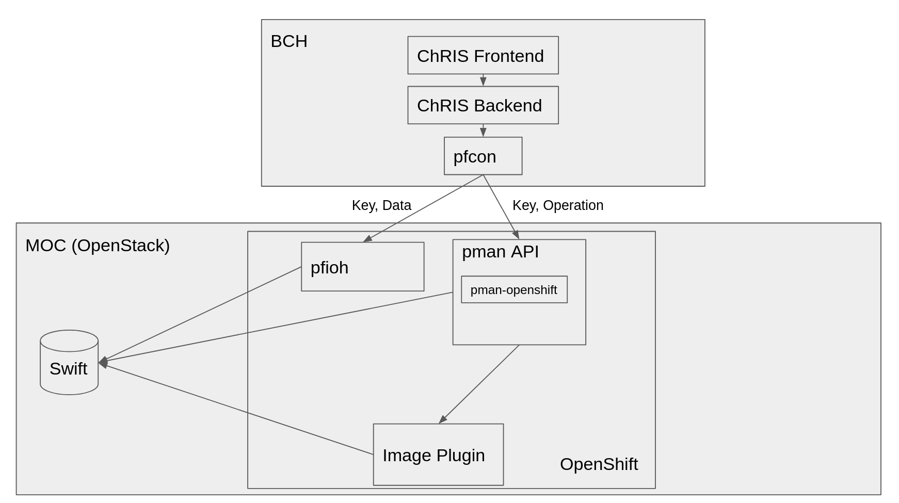

# Radiology
The radiology project is a collaboration with Boston Children's Hospital, Boston University, and Red Hat to improve the scale and performance of [ChRIS](https://github.com/FNNDSC/).

## ChRIS
ChRIS (Children’s Research Integration System) is a web-based medical image platform that allows for various forms of medical image processing (for example, MRIs). ChRIS itself is comprised of multiple open source projects hosted on [GitHub](https://github.com/FNNDSC/) with the intention to make the research and capabilities available to other hospitals and institutions.

## Massachusetts Open Cloud
The [MOC](https://massopen.cloud/) is a cloud computing environment built in collaboration with five Massachusetts area universities (Boston University, Harvard, MIT, Northeastern, UMass) used primarily for educational and research purposes. The MOC, however, has the goal of expanding its footprint and usage by providing vertical solutions, such as the ChRIS project, to other institutions with similar needs.

## Goals
Boston Children’s Hospital, Boston University, and Red Hat aim to improve the scale and efficiency of the ChRIS platform using the MOC and various Red Hat technologies, including OpenShift and OpenStack. Today, processing a single set of images takes about ten hours. The goal is to get that down to a few minutes to give patients quicker feedback.

## Architecture
ChRIS is comprised of several components and services, and it is designed to have multiple heterogeneous clusters available for image processing. In the example shown below, the data center providing the image processing is the MOC, which is backed by OpenShift running on OpenStack. The primary interfaces into the MOC are pman and pfioh. These interfaces provide the API for pfcon to communicate with the MOC, where pfioh handles the input/ouput, and pman handles the image processing requests. The image plugins themselves run as container jobs on OpenShift.

### Explanation of Terms
  * [ChRIS Frontend](https://github.com/FNNDSC/ChRIS_ultron_frontEnd) - The web-based interface for ChRIS
  * [ChRIS Backend](https://github.com/FNNDSC/ChRIS_ultron_backEnd) - The ChRIS REST API
  * [pfcon](https://github.com/FNNDSC/pfcon) - An abstraction API for ChRIS API to manage calls to different datacenters running pfioh and pman
  * [pfioh](https://github.com/FNNDSC/pfioh) - Handles input and output of image data into a data center
  * [pman](https://github.com/FNNDSC/pman) - Handles instantiating and checking the status of image processing jobs
  * Image Plugin(s) - An image processor. Turns raw image data into something meaningful for the radiologists/doctors. Ex: [FreeSurfer](https://surfer.nmr.mgh.harvard.edu/)
